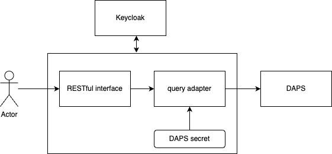

# <a id="introduction"></a>Catena-X DAPS Registration Service

DAPS Registration Service is a security mediator sitting 
between DAPS service and an admin user responsible for registering 
new clients (EDCs) to the DAPS. The admin user is protected with
keycloak bearer token and shall have appropriate role to create 
records at DAPS side. Therefore, the secrets for admin interface
of the DAPS are not disclosed to the requester.

# Solution Strategy 
For user authentication, Connector Registration Service relies 
on the Catena-X identity provider (keycloak). Connector 
Registration Service has access to a secret which allows 
using the remote administration plugin of the DAPS.



1. An admin user holding a bearer token with appropriate privileges
    calls REST interface of the service providing necessary information
    for registering new client (e.g. the client certificate)
2. The Service converts the request to the format acceptable by DAPS admin
    plugin and sends registration calls to that plugin. DAPS plugin secret
   is used for authentication. This secret is not disclosed to the caller.

# REST Interface

Here is definition of the interface in Java:
```java
    public void createClient(@RequestParam String clientName, @RequestParam(required = false) String securityProfile,
                             @RequestParam(required = false) String referringConnector, @RequestPart("file") MultipartFile file);
```
Two parameters are mandatory:
- clientName:  name of client
- file: Connector's certificate (public part)

Other parameters are optional:

- securityProfile: security profile. Default Value is `idsc:BASE_SECURITY_PROFILE`
- referringConnector: url of the Connector. By convention, we add BPN number at the
  end of the URL to keep reference to the BPN inside of DAT token

## Example:#
```http request
POST api/v1/daps?clientName=MyCompany HTTP/1.1
Content-Type: multipart/form-data; boundary=---------------------------9051914041544843365972754266
-----------------------------9051914041544843365972754266
Content-Disposition: form-data; name="file"; filename="certificate.crt"
Content-Type: text/plain

CONTENT OF A CERTIFICATE
-----------------------------9051914041544843365972754266
```

# Configuration
The configuration property file is located under `resources` folder and is incorporated
into the fat jar during build process. It can be customized before building if needed.
Or,the another one can be used as its location can be overridden:
```shell
java -jar dapsreg-0.0.1-SNAPSHOT.jar --spring.config.location=file:./custom-config/
```
Here application.yaml will be searched in custom-config dir.

## Self-Description Factory Property file
An example of `application.yaml` for SD-Factory is given bellow:
```yaml
keycloak:
  auth-server-url: https://keycloak.cx.dih-cloud.com
  realm: orchestrator
  resource: orchestratorservice
  bearer-only: true
  use-resource-role-mappings: true
  principal-attribute: preferred_username
app:
  build:
    version: ^project.version^
  daps:
    apiUri: https://daps-pen.int.demo.catena-x.net/api/v1
    tokenUri: https://daps-pen.int.demo.catena-x.net/token
    clientId: <ClientId>
    clientSecret: <ClientSecret>
  security:
    createRole: create_daps_client
    updateRole: update_daps_client
    deleteRole: delete_daps_client
```

Here `keycloak` section defines keycloak's parameters for authentication client requests.

`app.daps.apiUri` specifies URI of the API for the Admin pluging of the 
omejdn DAPS service. This API DAPS registration service uses for
registering clients on DAPS side.

`app.daps.tokenUri` is an endpoint used to fetch authorization token. This token is
used for calling omejdn admin API plugin.

`app.daps.clientId` is the client ID of the admin account registerd at DAPS

`app.daps.clientSecret` is client secret of the admin account

`app.security` - sets the roles a user must hold for creating, updating and removing
clients at DAPS side.


# Building
SD-Factory use Maven for building process. To build a service from sources one
need to go to the project directory and trigger building process:
```shell
cd SDFactory
./mvnw clean install
```
Please note, the test process uses Docker for performing the tests. 
An image with Omejdn DAPS server is expected to exist. The name 
of the image shall be provided in the `app.daps.imageName` section
of the test configuration file (`application-test.yml`) located at
`test/resources` directory.

Then fat jar file can be found in `target` folder as well as in local Maven repository.
it can be run with this command:
```shell
java -jar target/dapsreg-0.0.1-SNAPSHOT.jar
```
Please note the name of jar-file as it may differ if version is changed.


## Installation Steps:-

Helm charts are provided inside https://github.com/catenax-ng/product-daps-registration-service

There are diffrent ways to do the installation.


1. Using helm commands:-  

    a.) git clone https://github.com/catenax-ng/product-daps-registration-service.git  <br />
    b.) Modify values file according to your requirement.  <br />
    c.) You need to define the secrets as well in values.yaml
        secret:     
          secretName:   -> Name of the secret  <br />
          clientId:  -> Client id for DAPS.   
          clientSecret:   -> Client id for DAPS  <br />
          authServerUrl:   -> Auth URL for keycloak. <br />
          realm:   -> Realm for keycloak    <br />
          resource:   -> Realm for keycloak.   <br />
          apiUri:  ->   DAPS API URL.  
          tokenUri:   -> DAPS token URL. 

    d.) These secrets should be defined in Hashicorp vault. <br />
    e.) Deploy in a kubernetes cluster  <br />
        helm install daps-reg-svc charts/daps-reg-service/ -n NameSpace  <br />

2. Using ArgoCD. 


To see how to deploy an application on 'Hotel Budapest': 
[How to deploy](https://catenax-ng.github.io/docs/guides/ArgoCD/how-to-deploy-an-application)

- - -
